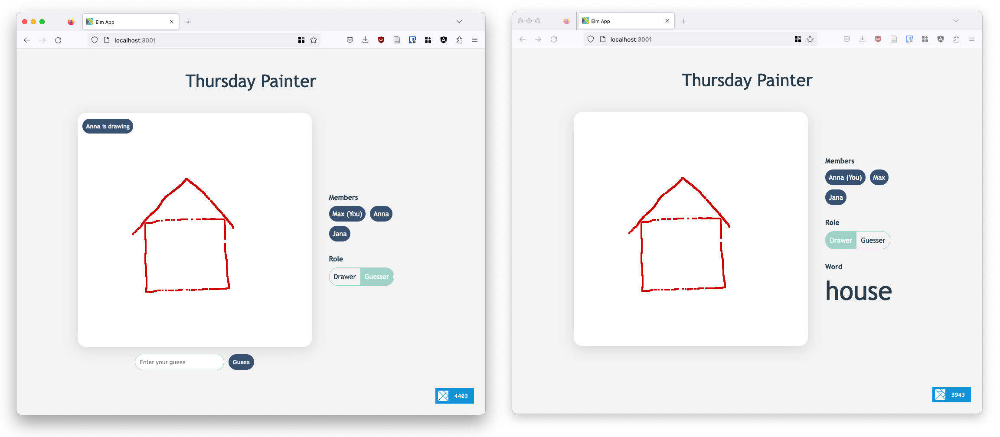

# Thursday Painter



Thursday Painter is a fun game to play with your friends. It is as simple as the original Montagsmaler game, just completely online and browser-based.

As soon as more than 2 players joined the game, someone will be elected as a drawer and a word will be randomly chosen by the backend.

The game is implemented in [Haskell](https://www.haskell.org/) on the server-side and in [Elm](https://elm-lang.org/) on the client-side.

## Getting started

1. Start the backend

    ```bash
    cd packages/backend
    cabal run ThursdayPainter
    ```

2. Start the Elm frontend

    *Make sure `create-elm-app` is installed.*

    ```bash
    npm install create-elm-app -g
    ```

    Start using `elm-app`

    ```bash
    elm-app start
    ```
